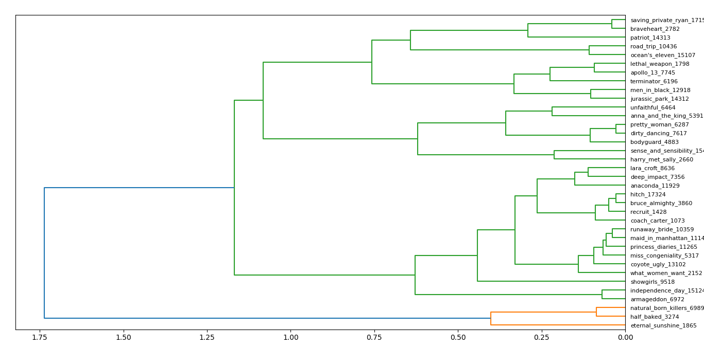
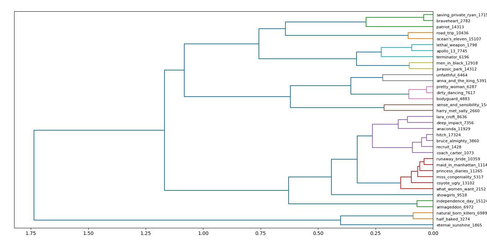

This is a note describing a hierarchical clustering experiment performed over the movie vectors learnt by the matrix factorization model.

To perform this experiment you will need to install `scipy` and `matplotlib`:
```
$ pip install scipy matplotlib
```

### Background

The parameters learnt by the matrix factorization model are not just useful in predicting future ratings, but also serve as a characterization of the users and movies. To be more specific, the biases can be interpreted as follows:
  - a positive movie bias can be taken to mean that the movie was more on the 'hit' side whereas a negative value means that it was more of a 'flop',
  - and a positive user bias can be taken to mean that the user is towards the 'generous' end of the rating scale whereas a negative value means that he/she is towards the 'critical' end.

The movie and user vectors, on the other hand, can be viewed as "profiles" of their corresponding movies and users. The idea is that the matrix factorization model takes the dot product of a user vector and a movie vector - and the dot product is proportional to the cosine similarity. So, essentially, the matrix factorization model bases its rating prediction on the similarity between a user and a movie: the similarity between a user's "tastes", as encoded by the user vector, and a movie's "genres", as encoded by the movie vector.

The objective of this clustering experiment is to see if the movie vectors do capture intuitive "genres" of movies, or not. Are similar movies indeed grouped together? Let us find out.

### Movies

First, we need to choose the movies we want to work with. Preferably
  - These movies must be relatively well-known, so that we have adequate rating data in order to capture their characteristics accurately.
  - The entire set of movies must be well-balanced, covering a diverse set of genres, so that we can hope to get satisfactory clustering results.

With these two points in mind, I chose a set of 36 movies, which include:
  - box-office superhits, such as 'Independence Day', 'Lethal Weapon', 'Men in Black', 'Ocean's Eleven' and 'The Terminator',
  - all-time classics, such as 'Apollo 13', 'Braveheart', 'Pretty Woman', 'Saving Private Ryan' and 'When Harry Met Sally',
  - casual flicks, such as 'Bruce Almighty', 'Hitch', 'Maid in Manhattan', 'Miss Congeniality', 'Runaway Bride', 'The Princess Diaries' and 'What Women Want',
  - films with a very "different" genre or combination of genres, such as 'Coach Carter', 'Coyote Ugly', 'Eternal Sunshine of the Spotless Mind' and 'Unfaithful',
  - films appealing to a minority audience interested in that particular genre, such as 'Half Baked',
  - well-known flops, such as 'Anaconda' and 'Lara Croft Tomb Raider: The Cradle of Life',
  - and controversial films, such as 'Natural Born Killers' and 'Showgirls'.

You can find the complete list [here](#movie-list). You may have seen or at least heard of many of these movies, but if you haven't, I have listed a short plot summary (taken from IMDb) along with each movie so that you can familiarize yourself with all the movies.

### Training

After extracting the rating data of these 36 movies one-by-one using `extract.sh`, we can run `train.py` to train the matrix factorization model.
```
$ python3 train.py --eta-bu 0.07 --eta-bm 0.07 --eta-vu 0.08 --eta-vm 0.08 --lambda-bu 0.03 --lambda-bm 0.03 --lambda-vu 0.0015 --lambda-vm 0.0015
Loading rating data ... 
files: 100%|███████████████████████████████████| 36/36 [00:37<00:00,  1.04s/it]
3742159 total.
Split into training data with 2805813 ratings and test data with 936346 ratings.
Performing stochastic gradient descent (with adagrad update) ...
iterations: 100%|█████████████████| 2805813/2805813 [01:46<00:00, 26327.01it/s]
Calculating training RMSE ...
iterations: 100%|████████████████| 2805813/2805813 [00:16<00:00, 166371.43it/s]
Training RMSE: 0.779721
Calculating test RMSE ...
iterations: 100%|██████████████████| 936346/936346 [00:05<00:00, 170844.32it/s]
Test RMSE: 0.918200
Trained parameters saved to params.pkl
```

(The regularization penalty values were taken from Koren (2009), p. 7?, while the learning rates were chosen by fiddling around with some numbers close to 0.1.)

This set of 36 movies amounts to a little more than 3.7 million ratings in total, primarily because many of the movies are well-known.

Training concludes with a training RMSE of approx. 0.78 and a test RMSE of approx. 0.92. The RMSE can be interpreted as a measure of how much the predicted rating deviates from the true rating on average, i.e. a test RMSE of 0.92 indicates that typically the rating is off by a little less than 1 star.

### Clustering

With that, we are ready to perform clustering on the movie vectors!

First, let us load the movie vectors from the `params.pkl` file:
```python
>>> import pickle
>>> with open('params.pkl', 'rb') as f:
        params = pickle.load(f)
>>> movie_vecs = params['movie_vecs']
```

We will also need the names of the movies:
```python
>>> movie_names = params['movie_names']
```

Note that we are going to perform hierarchical clustering, as opposed to K-means clustering. This is because we don't know how many clusters to expect beforehand. Another point is that K-means clustering will not perform well with just 36 data points.

We can perform either single linkage or complete linkage hierarchical clustering (there are other methods too, but they are beyond the scope of this discussion). Here, we are going to go with complete linkage clustering. The results obtained by single linkage clustering are similar, but complete linkage produces slightly better results in our case - the clusters are more compact.

`scipy` makes it very easy to perform hierarchical clustering:
```python
>>> from scipy.cluster.hierarchy import linkage
>>> clustering = linkage(movie_vecs, method='complete', metric='cosine')
```
The two keyword arguments passed to the `linkage` function ensure that complete linkage clustering is performed (instead of single linkage which is the default) and the distance metric used is cosine distance (instead of the default Euclidean distance).

Why use cosine distance? As we mentioned earlier, the matrix factorization model takes the dot product of the user and movie vectors, and the dot product is proportional to the cosine similarity. So, when measuring the similarity between two movie vectors, it makes more sense to use the cosine similarity here as well.

`clustering` contains what is known as a 'linkage matrix'. In order to visualize the clustering, we have to plot a dendrogram:
```python
>>> import matplotlib.pyplot as plt
>>> from scipy.cluster.hierarchy import dendrogram
>>> dendrogram(clustering, orientation='left', labels=movie_names)
>>> plt.show()
```
Passing `orientation='left'` changes the orientation of the dendrogram from the default of top-to-bottom to left-to-right, in order to make it easier to read. `labels=movie_names` sets the labels of the leaf nodes of the dendrogram to the names of the movies, so that we can interpret the clustering.

And finally, the resulting dendrogram looks like this:



You can see the entire hierarchy of clusters, with the names of the movies on the y-axis. The x-axis actually denotes distance - the distance between two (or more) clusters when they got merged.

This dendrogram is rather hard to read, because there is one "giant" cluster in green and another tiny cluster in "orange". We can change this by specifying a `color_threshold` parameter to the `dendrogram` function. This `color_threshold` parameter accepts a distance and "cuts" up clusters that were merged just beyond this distance, so that their immediate sub-clusters are shown in colours of their own. The result will make it more clear (we choose a distance of 0.3):
```python
>>> dendrogram(clustering, orientation='left', labels=movie_names, color_threshold=0.3)
>>> plt.show()
```



Now you can read the dendrogram and observe the clusters formed:
  - The green cluster at the top collects three movies which have a central theme of nationalism.
  - The orange cluster at the top pairs two movies which appeal to a male audience.
  - The light-blue cluster collects three movies that have a strong element of action and thriller.
  - The olive-green cluster pairs two movies that involve sci-fi.
  - The gray cluster pairs two movies that involve a romantic plot, but are different from typical romantic storylines.
  - The pink cluster collects three serious romantic movies with a highly popular soundtrack. In fact, coincidentally, all three movies have a storyline which involves a class difference between the two protagonists (as in, one of the partners is wealthy/elite whereas the other comes from an ordinary background).
  - The brown cluster pairs two romantic movies that are regarded as all-time classics.
  - The red cluster collects six women-centric movies, i.e. they appeal to a female audience and/or the leading characters in the film are female. Many of them have a casual romantic backdrop.
  - The green cluster at the bottom pairs two movies that are an even mix of action and sci-fi.
  - The orange cluster at the bottom pairs two movies which have a central theme of crime, and appeal to a male audience.

The purple cluster does not have any coherent theme that I can think of - it seems to be the cluster of all those movies that didn't fit anywhere else! Besides the purple cluster, we have two movies that are isolated: 'Showgirls' was a highly controversial film, and 'Eternal Sunshine of the Spotless Mind' is an odd mix of romance and sci-fi - this probably explains their isolation.

So, what do we glean from this?

This experiment shows us that the movie vectors do capture very relevant genres of movies. They lead to a very natural clustering which aligns with our intuition.

### Movie Biases

That concludes our clustering experiment on the movie vectors, but let us briefly also touch upon the movie biases.
```python
>>> movie_biases = params['movie_biases']
```
Let us neatly list each of the biases along with their corresponding movie:
```python
>>> for name, bias in zip(movie_names, movie_biases):
       print(f'{name:30}\t{bias:+.6f}') 
```
```
anaconda_11929                	-1.097872
anna_and_the_king_5391        	-0.152960
apollo_13_7745                	+0.343235
armageddon_6972               	-0.232875
bodyguard_4883                	-0.579855
braveheart_2782               	+0.551264
bruce_almighty_3860           	-0.295132
coach_carter_1073             	+0.255338
coyote_ugly_13102             	-0.629162
deep_impact_7356              	-0.426642
dirty_dancing_7617            	-0.079489
eternal_sunshine_1865         	-0.025575
half_baked_3274               	-0.000907
harry_met_sally_2660          	+0.321717
hitch_17324                   	+0.107975
independence_day_15124        	-0.034550
jurassic_park_14312           	+0.086512
lara_croft_8636               	-0.535753
lethal_weapon_1798            	+0.214101
maid_in_manhattan_11149       	-0.712402
men_in_black_12918            	+0.050286
miss_congeniality_5317        	-0.397857
natural_born_killers_6989     	-0.338610
ocean's_eleven_15107          	+0.186253
patriot_14313                 	+0.019349
pretty_woman_6287             	+0.146582
princess_diaries_11265        	-0.277018
recruit_1428                  	-0.201644
road_trip_10436               	-0.308950
runaway_bride_10359           	-0.540043
saving_private_ryan_17157     	+0.552805
sense_and_sensibility_15421   	+0.282354
showgirls_9518                	-1.156831
terminator_6196               	+0.238105
unfaithful_6464               	-0.262155
what_women_want_2152          	-0.348929
```
You can see how the bias reflects whether the movie was more on the 'hit' side or more of a 'flop'. 'Showgirls' which is commonly regarded as the worst movie of all time has a high negative bias of approx. -1.16 whereas a critically acclaimed film such as 'Saving Private Ryan' has a high positive bias of approx. +0.55.

### Movie List

| Name | Year | Cast | Plot Summary |
| :--- | :--- | :--- | :----------- |
| [Anaconda](https://www.imdb.com/title/tt0118615/) | 1997 | Jon Voight, Jennifer Lopez | A "National Geographic" film crew is taken hostage by an insane hunter, who forces them along on his quest to capture the world's largest - and deadliest - snake. |
| [Anna and the King](https://www.imdb.com/title/tt0166485/) | 1999 | Jodie Foster, Yun-Fat Chow | The story of the romance between the King of Siam and widowed British schoolteacher, Anna Leonowens, during the 1860s. |
| [Apollo 13](https://www.imdb.com/title/tt0112384/) | 1995 | Tom Hanks, Bill Paxton | NASA must devise a strategy to return Apollo 13 to Earth safely after the spacecraft undergoes massive internal damage putting the lives of the three astronauts on board in jeopardy. |
| [Armageddon](https://www.imdb.com/title/tt0120591/) | 1998 | Bruce Willis, Billy Bob Thornton | After discovering that an asteroid the size of Texas is going to impact Earth in less than a month, NASA recruits a misfit team of deep-core drillers to save the planet. |
| [Braveheart](https://www.imdb.com/title/tt0112573/) | 1995 | Mel Gibson, Sophie Marceau | Scottish warrior William Wallace leads his countrymen in a rebellion to free his homeland from the tyranny of King Edward I of England. |
| [Bruce Almighty](https://www.imdb.com/title/tt0315327/) | 2003 | Jim Carrey, Jennifer Aniston | A guy who complains about God too often is given almighty powers to teach him how difficult it is to run the world. |
| [Coach Carter](https://www.imdb.com/title/tt0393162/) | 2005 | Samuel L. Jackson, Rick Gonzalez | Controversy surrounds high school basketball coach Ken Carter after he benches his entire team for breaking their academic contract with him. |
| [Coyote Ugly](https://www.imdb.com/title/tt0200550/) | 2000 | Piper Perabo, Adam Garcia | Aspiring songwriter Violet Sanford, after getting a job at a women-run NYC bar that teases its male patrons, comes out of her shell. |
| [Deep Impact](https://www.imdb.com/title/tt0120647/) | 1998 | Robert Duvall, Téa Leoni | A comet is discovered to be on a collision course with Earth. As doomsday nears, the human race prepares for the worst. |
| [Dirty Dancing](https://www.imdb.com/title/tt0092890/) | 1987 | Patrick Swayze, Jennifer Grey | Spending the summer at a Catskills resort with her family, Frances "Baby" Houseman falls in love with the camp's dance instructor, Johnny Castle. |
| [Eternal Sunshine of the Spotless Mind](https://www.imdb.com/title/tt0338013/) | 2004 | Jim Carrey, Kate Winslet | When their relationship turns sour, a couple undergoes a medical procedure to have each other erased from their memories. |
| [Half Baked](https://www.imdb.com/title/tt0120693/) | 1998 | Dave Chappelle, Guillermo Díaz | The story of three not so bright men who come up with a series of crazy schemes to get a friend out of jail. |
| [Hitch](https://www.imdb.com/title/tt0386588/) | 2005 | Will Smith, Eva Mendes | A smooth-talking man falls for a hardened columnist while helping a shy accountant woo a beautiful heiress. |
| [Independence Day](https://www.imdb.com/title/tt0116629/) | 1996 | Will Smith, Bill Pulman | The aliens are coming and their goal is to invade and destroy Earth. Fighting superior technology, mankind's best weapon is the will to survive. |
| [Jurassic Park](https://www.imdb.com/title/tt0107290/) | 1993 | Sam Neill, Laura Dern | A pragmatic paleontologist visiting an almost complete theme park is tasked with protecting a couple of kids after a power failure causes the park's cloned dinosaurs to run loose. |
| [Lara Croft Tomb Raider: The Cradle of Life](https://www.imdb.com/title/tt0325703/) | 2003 | Angelina Jolie, Gerard Butler | Adventurer Lara Croft goes on a quest to save the mythical Pandora's Box, before an evil scientist finds it, and recruits a former Marine turned mercenary to assist her. |
| [Lethal Weapon](https://www.imdb.com/title/tt0093409/) | 1987 | Mel Gibson, Danny Glover | Two newly paired cops who are complete opposites must put aside their differences in order to catch a gang of drug smugglers. |
| [Maid in Manhattan](https://www.imdb.com/title/tt0252076/) | 2002 | Jennifer Lopez, Ralph Fiennes | A Senatorial candidate falls for a hotel maid, thinking she is a socialite, when he sees her trying on a wealthy woman's dress. |
| [Men in Black](https://www.imdb.com/title/tt0119654/) | 1997 | Tommy Lee Jones, Will Smith | A police officer joins a secret organization that polices and monitors extraterrestrial interactions on Earth. |
| [Miss Congeniality](https://www.imdb.com/title/tt0212346/) | 2000 | Sandra Bullock, Michael Caine | An F.B.I. Agent must go undercover in the Miss United States beauty pageant to prevent a group from bombing the event. |
| [Natural Born Killers](https://www.imdb.com/title/tt0110632/) | 1994 | Woody Harrelson, Juliette Lewis | Two victims of traumatized childhoods become lovers and psychopathic serial murderers irresponsibly glorified by the mass media. |
| [Ocean's Eleven](https://www.imdb.com/title/tt0240772/) | 2001 | George Clooney, Brad Pitt | Danny Ocean and his ten accomplices plan to rob three Las Vegas casinos simultaneously. |
| [Pretty Woman](https://www.imdb.com/title/tt0100405/) | 1990 | Richard Gere, Julia Roberts | A man in a legal but hurtful business needs an escort for some social events, and hires a beautiful prostitute he meets... only to fall in love. |
| [Road Trip](https://www.imdb.com/title/tt0215129/) | 2000 | Breckin Mayer, Seann William Scott | Four college buddies embark on a road trip to retrieve an illicit tape mistakenly mailed to a female friend. |
| [Runaway Bride](https://www.imdb.com/title/tt0163187/) | 1999 | Richard Gere, Julia Roberts | A reporter is assigned to write a story about a woman who has left a string of fiancés at the altar. |
| [Saving Private Ryan](https://www.imdb.com/title/tt0120815/) | 1998 | Tom Hanks, Matt Damon | Following the Normandy Landings, a group of U.S. soldiers go behind enemy lines to retrieve a paratrooper whose brothers have been killed in action. |
| [Sense and Sensibility](https://www.imdb.com/title/tt0114388/) | 1995 | Emma Thompson, Kate Winslet | Rich Mr. Dashwood dies, leaving his second wife and her three daughters poor by the rules of inheritance. The two eldest daughters are the title opposites. |
| [Showgirls](https://www.imdb.com/title/tt0114436/) | 1995 | Elizabeth Berkley, Kyle MacLachlan | Nomi, a young drifter, arrives in Las Vegas to become a dancer and soon sets about clawing and pushing her way to become the top of the Vegas showgirls. |
| [The Bodyguard](https://www.imdb.com/title/tt0103855/) | 1992 | Kevin Costner, Whitney Houston | A former Secret Service agent takes on the job of bodyguard to an R&B singer, whose lifestyle is most unlike a President's. |
| [The Patriot](https://www.imdb.com/title/tt0187393/) | 2000 | Mel Gibson, Heath Ledger | Peaceful farmer Benjamin Martin is driven to lead the Colonial Militia during the American Revolution when a sadistic British officer murders his son. |
| [The Princess Diaries](https://www.imdb.com/title/tt0247638/) | 2001 | Julie Andrews, Anne Hathaway | Mia Thermopolis has just found out that she is the heir apparent to the throne of Genovia. With her friends Lilly and Michael Moscovitz in tow, she tries to navigate through the rest of her sixteenth year. |
| [The Recruit](https://www.imdb.com/title/tt0292506/) | 2003 | Al Pacino, Colin Farrell | A brilliant young CIA trainee is asked by his mentor to help find a mole in the Agency. |
| [The Terminator](https://www.imdb.com/title/tt0088247/) | 1984 | Arnold Schwarzenegger, Linda Hamilton | A human soldier is sent from 2029 to 1984 to stop an almost indestructible cyborg killing machine, sent from the same year, which has been programmed to execute a young woman whose unborn son is the key to humanity's future salvation. |
| [Unfaithful](https://www.imdb.com/title/tt0250797/) | 2002 | Richard Gere, Diane Lane | A New York suburban couple's marriage goes dangerously awry when the wife indulges in an adulterous fling. |
| [What Women Want](https://www.imdb.com/title/tt0207201/) | 2000 | Mel Gibson, Helen Hunt | After an accident, a chauvinistic executive gains the ability to hear what women are really thinking. |
| [When Harry Met Sally](https://www.imdb.com/title/tt0098635/) | 1989 | Billy Crystal, Meg Ryan | Harry and Sally have known each other for years, and are very good friends, but they fear sex would ruin the friendship. |
